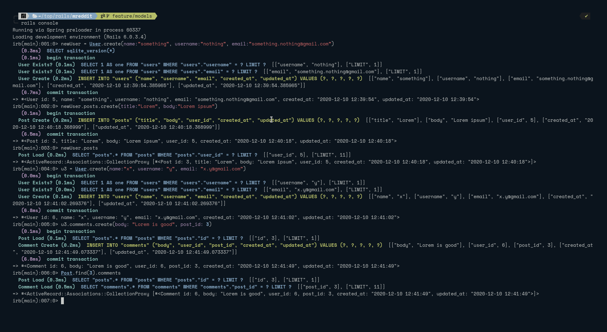

<h1 align="center">Micro-Reddit</h1>
<p align="center">A minimal clone of Reddit's backend. </p>

---

### About 
This app is a very simple clone of reddit's backend with a few basic funcationalities. 

## Prerequisites
Prior to using this app, please make sure you have the _Ruby_ and _Ruby On Rails_ installed.

## Available Features
- Users can be created
- Users can create posts
- User can comment on posts

## Getting Started

Use following command to install all the dependencies

```
bundle install
```

There is no front-end for this app. So, the user will have to use Rails console to interact with the application.

### Step 1

To get started you have to clone the repo on your local machine. To clone the repo run the following command in a terminal emulator:
   
```
git clone https://github.com/smcommits/micro_reddit
```
       
Alternatively, you can click [this link](https://github.com/smcommits/micro_reddit/archive/develop.zip) to download the repo as a zip file.

### Step 2

Now navigate to the repo

```
cd micro_reddit
```

### Step 3

Launch rails console using the following command

```
rails console
```

The basic functionalities of the application can be seen in the following screenshot


## Under the hood
This project is designed using the web development framework **Ruby On Rails**

## Authors

👤 **Anas Siddiqui**

- GitHub: [Anas Siddiqui](https://github.com/smcommits)


## 🤝Contributing

Contributions, issues, and feature requests are welcome!

## Show your support

Give a ⭐️ if you like this project
